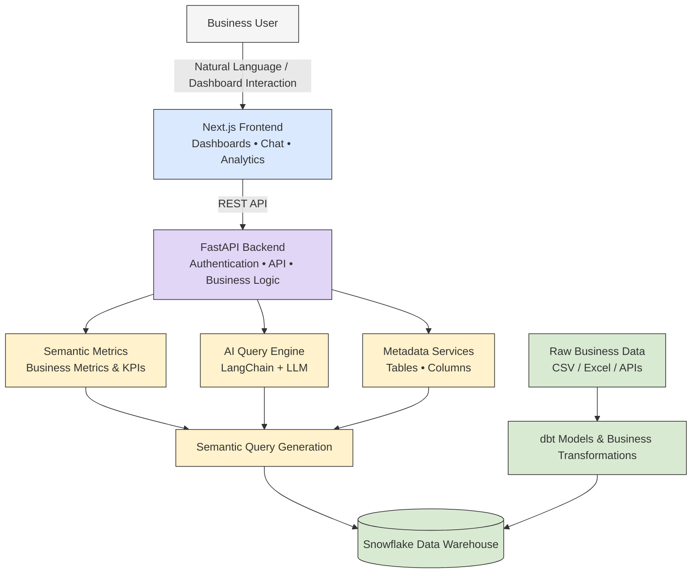

# 🚀 MetricMind

### Enterprise Semantic Business Intelligence Engine

Building an AI-ready analytics platform using Snowflake, dbt, FastAPI and a custom semantic layer.

## Description

MetricMind is an enterprise Semantic Business Intelligence (BI) Engine designed using modern analytics engineering practices.

The project combines Snowflake, dbt, FastAPI, and a custom semantic layer to build an AI-ready analytics platform capable of serving governed business metrics through REST APIs.

Currently, MetricMind includes a modular backend, metadata discovery APIs, and a scalable architecture that will later support natural language querying, semantic metrics, and an interactive analytics dashboard.

## 🛠 Technologies

- **Programming Language:** Python 3.13
- **Cloud Data Warehouse:** Snowflake
- **Data Transformation:** dbt
- **Backend Framework:** FastAPI
- **Semantic Layer:** Custom Python Semantic Layer
- **AI Framework:** LangChain *(planned integration)*
- **Frontend:** Next.js *(planned)*
- **Version Control:** Git & GitHub

## Project Architecture


## Project Structure

```text
MetricMind/
│
├── backend/               # Backend APIs and business logic
├── frontend/              # Next.js chat interface
├── dashboard/             # Analytics dashboards
├── data/
│   ├── raw/               # Raw business datasets
│   └── transformed/       # Cleaned and transformed datasets
│
├── dbt/                   # dbt transformation models
├── semantic/              # Cube.dev semantic layer
├── docs/                  # Project documentation
├── images/                # Images and diagrams
├── sql/                   # SQL scripts
├── src/                   # Source code
├── tests/                 # Unit and integration tests
│
├── README.md
├── requirements.txt
└── .gitignore
```
## Technology Stack

| Layer                | Technology |
|----------------------|------------|
| Programming Language | Python |
| Database             | Snowflake |
| Data Transformation  | dbt |
| Semantic Layer       | Custom Python Semantic Layer |
| AI Framework         | LangChain |
| Frontend             | Next.js |
| Version Control      | Git |
| Repository           | GitHub |
| Backend Framework    | FastAPI |

## 📡 REST API Endpoints

MetricMind exposes REST APIs for metadata discovery and backend services.

| Method | Endpoint | Description |
|--------|----------|-------------|
| GET | `/` | Returns the welcome message of the MetricMind API. |
| GET | `/health` | Checks whether the FastAPI service is running. |
| GET | `/db-health` | Verifies the connection to the Snowflake data warehouse. |
| GET | `/tables` | Returns all available tables from the connected Snowflake database. |
| GET | `/tables/{table_name}/columns` | Returns the schema (columns and data types) of the specified table. |

## Core Features

- AI-powered Natural Language Query Interface
- Enterprise Semantic Metrics Layer
- Modern ELT Pipeline using dbt
- Snowflake Cloud Data Warehouse
- Interactive Business Intelligence Dashboard
- Governed Business Metrics
- AI-driven Business Insights
- Scalable Data Modeling Architecture
- Streaming Chat-based Analytics
- Enterprise-grade Project Structure

## Planned Enhancements

- Role-based Authentication
- Query History
- KPI Monitoring Dashboard
- Predictive Analytics
- Multi-agent AI Workflow
- Report Export (PDF/Excel)
- Interactive Data Visualizations
- Real-time Business Metrics
- Dashboard Sharing
- Performance Optimization