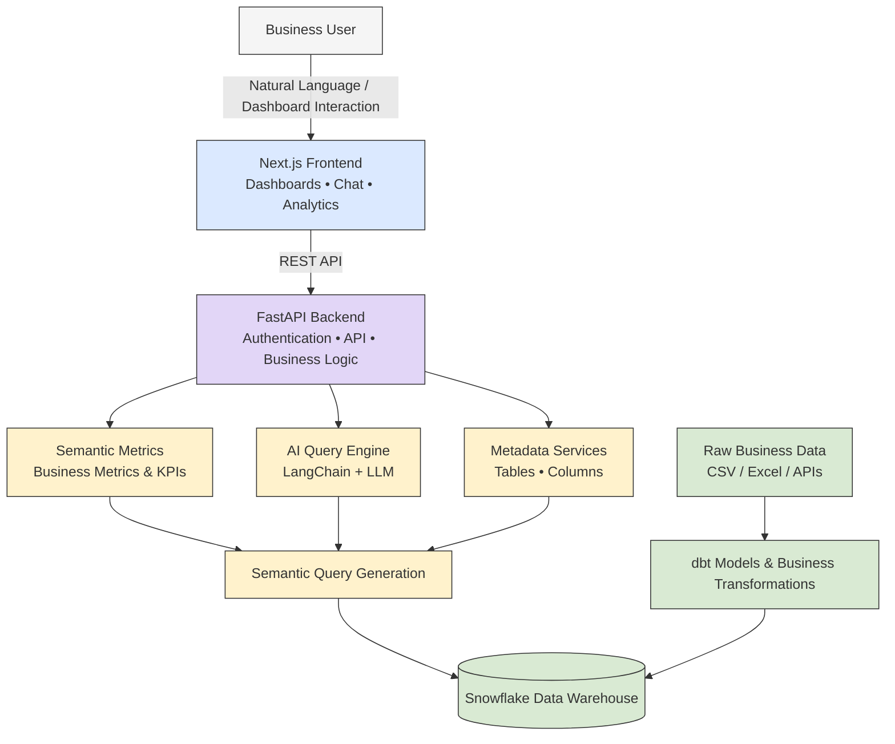

<p align="center">
  
  
  
  
  
</p>

<h1 align="center">MetricMind</h1>
<h3 align="center">Enterprise Semantic Business Intelligence Engine</h3>

<p align="center">
  Turn natural language business questions into governed insights — powered by a custom semantic layer, Snowflake, dbt, and FastAPI.
</p>

<p align="center">
  <a href="#-overview">Overview</a> •
  <a href="#-features">Features</a> •
  <a href="#-architecture">Architecture</a> •
  <a href="#-tech-stack">Tech Stack</a> •
  <a href="#-installation">Installation</a> •
  <a href="#-api-reference">API</a> •
  <a href="#-project-status">Status</a>
</p>

---

## Overview

**MetricMind** is a semantic Business Intelligence engine that bridges the gap between business users and enterprise data — without requiring anyone to write SQL.

It takes a natural language question, converts it into a semantic query plan, generates optimized SQL, executes it against **Snowflake**, and returns structured, governed business insights through a REST API.

Built on modern analytics engineering practices — **Snowflake**, **FastAPI**, **dbt**, and a custom semantic layer — MetricMind is designed to be modular, scalable, and AI-ready, supporting:

- Semantic metrics & KPI analytics
- Natural language querying
- Intelligent SQL generation
- An enterprise-grade semantic layer
- AI-powered conversational BI *(in progress)*

---

## Features

<table>
<tr>
<td valign="top" width="50%">

**Semantic Intelligence**
- Semantic metric detection
- Natural language query planning
- Dynamic SQL generation
- Enterprise semantic layer
- Snowflake query execution

**Business Intelligence**
- KPI queries
- Business filter detection
- `GROUP BY` / `ORDER BY` / `LIMIT` detection
- Aggregate filtering (`HAVING`)

</td>
<td valign="top" width="50%">

**Time Intelligence**
- Year filters & date range queries
- Relative time intelligence
- Quarter intelligence & comparison

**Comparison Engine**
- State / category / quarter comparison
- Multi-dimensional semantic queries

**Backend**
- FastAPI REST APIs
- Metadata discovery APIs
- Semantic query APIs

</td>
</tr>
</table>

### Upcoming

Conversational BI assistant · AI dashboard generation · Visualization recommendation engine · LangChain integration · Interactive analytics dashboard · Authentication & user management · Query history · KPI monitoring · Report export (PDF / Excel)

---

## Architecture


```mermaid
flowchart TD
    A[Business User]
    B[Next.js Frontend<br/>Dashboards • Chat • Analytics]
    C[FastAPI Backend<br/>Authentication • API • Business Logic]
    D[Semantic Metrics<br/>Business Metrics & KPIs]
    E[AI Query Engine<br/>LangChain + LLM]
    F[Metadata Services<br/>Tables • Columns]
    G[Semantic Query Generation]
    H[(Snowflake Data Warehouse)]
    I[dbt Models & Business Transformations]
    J[Raw Business Data<br/>CSV / Excel / APIs]

    A -->|Natural Language / Dashboard Interaction| B
    B -->|REST API| C
    C --> D
    C --> E
    C --> F
    D --> G
    E --> G
    F --> G
    G --> H
    J --> I
    I --> H

    classDef user fill:#f5f5f5,stroke:#333,stroke-width:1px;
    classDef frontend fill:#dbe9ff,stroke:#333,stroke-width:1px;
    classDef backend fill:#e2d6f7,stroke:#333,stroke-width:1px;
    classDef core fill:#fff2cc,stroke:#333,stroke-width:1px;
    classDef data fill:#d9ead3,stroke:#333,stroke-width:1px;

    class A user;
    class B frontend;
    class C backend;
    class D,E,F,G core;
    class H,I,J data;
```

---

## Tech Stack

| Layer | Technology |
|---|---|
| Language | Python 3.13 |
| Backend Framework | FastAPI |
| Database | Snowflake |
| Data Transformation | dbt |
| Semantic Layer | Custom Python semantic layer |
| AI Integration | LangChain *(planned)* |
| Frontend | Next.js *(planned)* |
| Version Control | Git & GitHub |
| IDE | PyCharm |
| API Testing | Swagger UI / Postman |

---

## 📂 Project Structure

```text
MetricMind/
│
├── backend/
│   ├── app/
│   │   ├── api/                 # REST API endpoints
│   │   ├── semantic/            # Semantic metrics & metadata
│   │   ├── services/            # Query planner & SQL generator
│   │   ├── database/            # Snowflake connection
│   │   └── main.py              # FastAPI entry point
│   │
│   ├── database/
│   │   └── migrations/          # Database migration scripts
│   │
│   └── requirements.txt
│
├── frontend/                    # Next.js frontend (upcoming)
├── dashboard/                   # Dashboard (upcoming)
├── dbt/                         # dbt models
├── docs/                        # Documentation
├── sql/                         # SQL scripts
├── images/                      # Project images
├── tests/                       # Unit tests
│
├── README.md
└── .gitignore
```

---

## Installation

```bash
# Clone the repository
git clone https://github.com/hSujal-1/MetricMind.git
cd MetricMind

# Create a virtual environment
python -m venv .venv

# Activate it
# Windows
.venv\Scripts\activate
# Linux / macOS
source .venv/bin/activate

# Install dependencies
pip install -r backend/requirements.txt
```

### Running the project

```bash
uvicorn app.main:app --reload
```

| Docs | URL |
|---|---|
| Swagger UI | `http://127.0.0.1:8000/docs` |
| ReDoc | `http://127.0.0.1:8000/redoc` |

---

## API Reference

| Method | Endpoint | Description |
|---|---|---|
| GET | `/` | Welcome endpoint |
| GET | `/health` | Health check |
| GET | `/db-health` | Verify Snowflake connection |
| GET | `/tables` | List available tables |
| GET | `/tables/{table_name}/columns` | Retrieve table schema |
| POST | `/queryplanner` | Generate semantic query plan |
| POST | `/generate-sql` | Generate SQL from semantic query plan |
| POST | `/ask` | Execute a natural language query and return results |

---

## Example Queries

<details>
<summary><strong>KPI queries</strong></summary>

```text
Total Sales
Total Profit
Total Orders
Total Quantity
Average Discount
```
</details>

<details>
<summary><strong>Business filters</strong></summary>

```text
Sales in California
Profit in Texas
Technology Sales
Furniture Profit
Office Supplies Orders
```
</details>

<details>
<summary><strong>Group by queries</strong></summary>

```text
Sales by City
Profit by Category
Orders by State
Sales by Region
Profit by Segment
```
</details>

<details>
<summary><strong>Ranking queries</strong></summary>

```text
Top 10 Cities by Sales
Top 5 Categories by Profit
Highest Profit States
Lowest Sales Regions
Top 20 Cities by Orders
```
</details>

<details>
<summary><strong>Aggregate filtering (HAVING)</strong></summary>

```text
Cities with Sales above 500000
Categories with Profit below 10000
States with Orders above 2000
```
</details>

<details>
<summary><strong>Comparison queries</strong></summary>

```text
Compare California and Texas Sales
Compare Technology and Furniture Profit
Compare Office Supplies and Technology Orders
```
</details>

<details>
<summary><strong>Time intelligence</strong></summary>

```text
Sales in 2014
Profit after 2013
Sales between 2012 and 2014
Orders this year
Sales last year
Profit previous year
```
</details>

<details>
<summary><strong>Quarter intelligence</strong></summary>

```text
Sales in Q1
Profit in Quarter 2
Orders in Q3
Sales in Q2 2014
Profit in Q4 this year
Compare Q1 and Q2 Sales
Compare Q3 and Q4 Profit
```
</details>

<details>
<summary><strong>Complex semantic queries</strong></summary>

```text
Top 10 Cities with Sales between 2012 and 2014
Top 5 Categories with Sales above 500000
Compare Technology and Furniture Profit
Compare Q1 and Q2 Sales in 2014
Sales in California during Q2
Categories with Profit after 2013
Top 10 Cities by Profit in Q3
```
</details>

---

## Project Status

**Status:** 🟢 Active development &nbsp;|&nbsp; **Version:** v0.9 (Backend) &nbsp;|&nbsp; **Backend completion:** ~92%

| Module |      Status      |
|---|:----------------:|
| Backend APIs | Completed (core) |
| Semantic query engine |    Completed     |
| Snowflake integration |    Completed     |
| Natural language query planner |    Completed     |
| Dynamic SQL generator |     Completed    |
| Frontend dashboard |   In progress  |
| AI copilot (LLM) |     Planned    |

---

## Vision

The long-term goal is to evolve MetricMind into a full AI-powered BI platform — supporting conversational analytics, intelligent dashboard generation, and automated business insights on top of the semantic layer already in place.

---

## License

Licensed under the [MIT License](LICENSE).