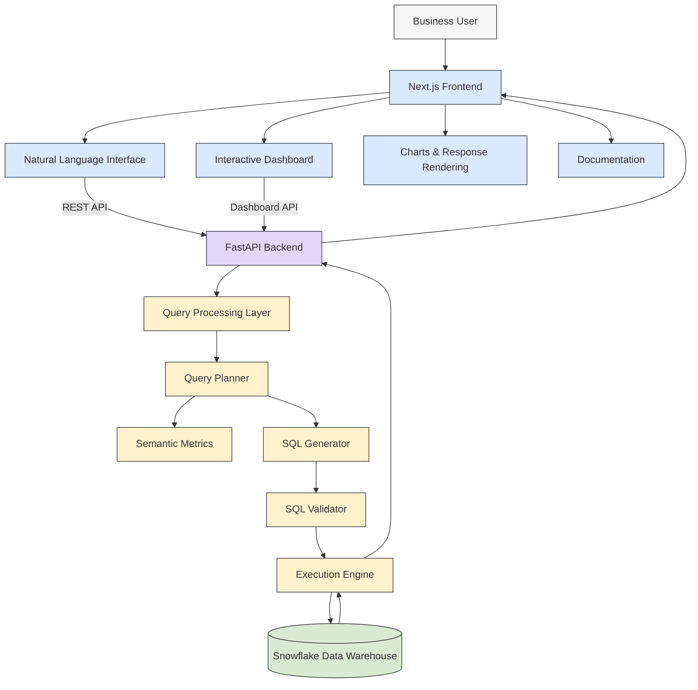

<p align="center">
  
  
  
  
  
  
</p>

<h1 align="center">MetricMind</h1>

<h3 align="center">Enterprise Semantic Business Intelligence Engine</h3>

<p align="center">
  Turn natural language business questions into governed business insights using a custom semantic layer, Snowflake, FastAPI, and Next.js.
</p>

<p align="center">
  <a href="#overview">Overview</a> •
  <a href="#features">Features</a> •
  <a href="#architecture">Architecture</a> •
  <a href="#tech-stack">Tech Stack</a> •
  <a href="#project-structure">Project Structure</a> •
  <a href="#installation">Installation</a> •
  <a href="#api-reference">API Reference</a> •
  <a href="#dashboard">Dashboard</a> •
  <a href="#project-status">Project Status</a>
</p>

---

## Overview

**MetricMind** is a semantic Business Intelligence platform that allows users to interact with business data using natural language instead of writing SQL queries manually.

A user can ask questions such as:

```text
What are the total sales?
What is the total profit?
What are the sales by region?
What are the sales by category?
What are the top 10 cities by sales?
```

MetricMind interprets the question, maps it to governed business metrics through a semantic layer, generates and validates SQL, executes it against Snowflake, and returns structured, chart-ready results.

---

## Features

- Natural language to SQL query translation
- Governed semantic metric definitions (single source of truth for business logic)
- Automatic SQL generation and validation before execution
- Interactive Business Intelligence dashboard with KPIs and charts
- REST API with full Swagger/OpenAPI documentation
- Snowflake-backed data warehouse integration

---

## Architecture

MetricMind follows a layered architecture that separates the frontend interface, backend API layer, semantic intelligence, query execution, and data warehouse.


```mermaid
flowchart TD

    A[Business User]

    B[Next.js Frontend]
    B1[Natural Language Interface]
    B2[Interactive Dashboard]
    B3[Charts & Response Rendering]
    B4[Documentation]

    C[FastAPI Backend]

    D[Query Processing Layer]
    D1[Query Planner]
    D2[Semantic Metrics]
    D3[SQL Generator]
    D4[SQL Validator]

    E[Execution Engine]

    F[(Snowflake Data Warehouse)]

    A --> B

    B --> B1
    B --> B2
    B --> B3
    B --> B4

    B1 -->|REST API| C
    B2 -->|Dashboard API| C

    C --> D

    D --> D1
    D1 --> D2
    D1 --> D3
    D3 --> D4

    D4 --> E
    E --> F

    F --> E
    E --> C
    C --> B

    classDef user fill:#f5f5f5,stroke:#333,stroke-width:1px;
    classDef frontend fill:#dbe9ff,stroke:#333,stroke-width:1px;
    classDef backend fill:#e2d6f7,stroke:#333,stroke-width:1px;
    classDef core fill:#fff2cc,stroke:#333,stroke-width:1px;
    classDef data fill:#d9ead3,stroke:#333,stroke-width:1px;

    class A user;
    class B,B1,B2,B3,B4 frontend;
    class C backend;
    class D,D1,D2,D3,D4,E core;
    class F data;
```

---

## Tech Stack

| Layer | Technology |
|---|---|
| Programming Language | Python 3.13 |
| Backend Framework | FastAPI |
| Frontend Framework | Next.js 16 |
| Frontend Language | TypeScript |
| Database / Data Warehouse | Snowflake |
| Semantic Layer | Custom Python semantic layer |
| Query Processing | Python |
| Data Visualization | Recharts |
| API Communication | REST API |
| Version Control | Git & GitHub |
| API Testing | Swagger UI |
| IDE | PyCharm |

---

## Project Structure

```text
MetricMind/
│
├── backend/
│   ├── app/
│   │   ├── models/
│   │   │
│   │   ├── routers/
│   │   │   └── metrics.py
│   │   │
│   │   ├── semantic/
│   │   │   └── metrics.py
│   │   │
│   │   ├── services/
│   │   │   ├── execution_engine.py
│   │   │   ├── query_planner.py
│   │   │   ├── sql_generator.py
│   │   │   ├── sql_validator.py
│   │   │   ├── metrics_service.py
│   │   │   └── snowflake_service.py
│   │   │
│   │   ├── config.py
│   │   ├── database.py
│   │   └── main.py
│   │
│   └── requirements.txt
│
├── frontend/
│   ├── app/
│   │   ├── dashboard/
│   │   │   └── page.tsx
│   │   │
│   │   ├── docs/
│   │   │   └── page.tsx
│   │   │
│   │   ├── globals.css
│   │   ├── layout.tsx
│   │   └── page.tsx
│   │
│   ├── components/
│   │   ├── chat/
│   │   │   └── ChatBox.tsx
│   │   │
│   │   ├── layout/
│   │   │   ├── Hero.tsx
│   │   │   └── Navbar.tsx
│   │   │
│   │   ├── BarChart.tsx
│   │   ├── HorizontalBarChart.tsx
│   │   ├── InsightCard.tsx
│   │   ├── KPICard.tsx
│   │   ├── LineChart.tsx
│   │   ├── PieChart.tsx
│   │   ├── ResponseRenderer.tsx
│   │   ├── ResponseTable.tsx
│   │   └── VisualizationEngine.tsx
│   │
│   ├── services/
│   │   ├── api.ts
│   │   └── dashboardService.ts
│   │
│   ├── next.config.ts
│   └── package.json
│
├── README.md
├── .gitignore
└── LICENSE
```

---

## Installation

### Prerequisites

Make sure the following are installed before running MetricMind:

- Python 3.13
- Node.js and npm
- Git
- PyCharm (Professional or Community)
- Access to a configured Snowflake account

### 1. Clone the Repository

```bash
git clone https://github.com/hSujal-1/MetricMind.git
cd MetricMind
```

Open the `MetricMind` folder in **PyCharm** as a project (`File → Open`).

### 2. Backend Setup

Create a Python virtual environment:

```bash
python -m venv venv
```

Activate the environment:

```bash
# Windows
.\venv\Scripts\activate

# macOS / Linux
source venv/bin/activate
```

In PyCharm, set this `venv` as the project interpreter:
`File → Settings → Project: MetricMind → Python Interpreter → Add Interpreter → Existing Environment → select venv/Scripts/python.exe (or venv/bin/python)`.

Install the backend dependencies:

```bash
pip install -r backend/requirements.txt
```

Configure the required Snowflake credentials and application settings in the backend environment configuration.

> Do not commit credentials, passwords, tokens, or environment files containing secrets to GitHub.

### 3. Start the Backend

From the project root, with the virtual environment activated:

```bash
uvicorn app.main:app --reload --host 0.0.0.0
```

You can also run this directly from PyCharm by creating a **Run/Debug Configuration** of type *uvicorn* (or a Python configuration pointing to `app.main` with `uvicorn` as the module).

The backend will run on:

```
http://127.0.0.1:8000
```

### 4. Backend API Documentation

FastAPI provides interactive API documentation through Swagger UI:

```
http://127.0.0.1:8000/docs
```

ReDoc is also available at:

```
http://127.0.0.1:8000/redoc
```

### 5. Frontend Setup

Open a new terminal (PyCharm's integrated terminal works fine) and navigate to the frontend:

```bash
cd frontend
npm install
```

Start the Next.js development server:

```bash
npm run dev -- --hostname 0.0.0.0
```

The frontend will run on:

```
http://localhost:3000
```

### 6. Application Routes

| Route | Description |
|---|---|
| `/` | Main MetricMind natural-language analytics interface |
| `/dashboard` | Interactive Business Intelligence dashboard |
| `/docs` | MetricMind project documentation |

Local development URLs:

| Application | URL |
|---|---|
| Main Application | `http://localhost:3000` |
| Dashboard | `http://localhost:3000/dashboard` |
| Documentation | `http://localhost:3000/docs` |
| Backend API | `http://127.0.0.1:8000` |
| Swagger UI | `http://127.0.0.1:8000/docs` |

### 7. Running Backend and Frontend Together

MetricMind requires both services to be running during local development.

**Terminal 1 — Backend**

```bash
cd MetricMind
# activate venv first (see step 2)
uvicorn app.main:app --reload --host 0.0.0.0
```

**Terminal 2 — Frontend**

```bash
cd MetricMind/frontend
npm run dev -- --hostname 0.0.0.0
```

Once both services are running, open:

```
http://localhost:3000
```

### 8. Production Build Verification

To verify the Next.js frontend production build:

```bash
cd frontend
npm run build
```

A successful build verifies frontend compilation, TypeScript validation, route generation, and production optimization.

---

## API Reference

MetricMind exposes REST APIs through FastAPI for semantic query processing, SQL generation, metadata access, health monitoring, and natural-language business analysis.

| Method | Endpoint | Description |
|---|---|---|
| GET | `/` | Welcome endpoint |
| GET | `/health` | Application health check |
| GET | `/db-health` | Verify Snowflake connectivity |
| GET | `/tables` | List available database tables |
| GET | `/tables/{table_name}/columns` | Retrieve table column metadata |
| POST | `/queryplanner` | Generate a semantic query plan |
| POST | `/generate-sql` | Generate SQL from a semantic query plan |
| POST | `/ask` | Process a natural-language business question and return structured results |

### Natural Language Query

The primary analytics endpoint is:

```
POST /ask
```

Example request:

```json
{
  "question": "What are the total sales?"
}
```

The backend processes the question through the semantic query pipeline, executes the resulting query against Snowflake, and returns a structured response for the frontend.

### API Documentation

Interactive API documentation is available through Swagger UI:

```
http://127.0.0.1:8000/docs
```

---

## Dashboard

MetricMind includes an interactive Business Intelligence dashboard for visual analysis of business performance.

The dashboard is available at:

```
/dashboard
```

### KPI Summary

The dashboard includes:

- Total Sales
- Total Profit
- Regional Coverage
- Top City Performance

### Visual Analysis

The dashboard provides interactive visualizations for:

| Visualization | Purpose |
|---|---|
| Sales Trend | Analyze sales performance across time |
| Sales by Region | Compare sales across different regions |
| Sales by Category | Analyze category contribution to overall sales |
| Top 10 Cities | Identify the highest-performing cities by sales |

Charts include interactive hover information to allow users to inspect individual values directly from the visualization.

---

## Project Status

**Status:** Completed Project Submission

| Module | Status |
|---|:---:|
| FastAPI Backend | Completed |
| Semantic Query Engine | Completed |
| Metric Detection | Completed |
| Query Planning | Completed |
| Dynamic SQL Generation | Completed |
| SQL Validation | Completed |
| Snowflake Integration | Completed |
| Natural Language Querying | Completed |
| Frontend Interface | Completed |
| Interactive Visualizations | Completed |
| Business Intelligence Dashboard | Completed |
| Project Documentation | Completed |
| Production Frontend Build | Verified |

---

## Repository

GitHub Repository: [https://github.com/hSujal-1/MetricMind]

---

## License

Licensed under the [MIT License](LICENSE).

---

## Author

**Sujal Jambotkar**

MetricMind was developed as a Business Intelligence project focused on semantic analytics, natural-language querying, data visualization, and enterprise-oriented analytics workflows.