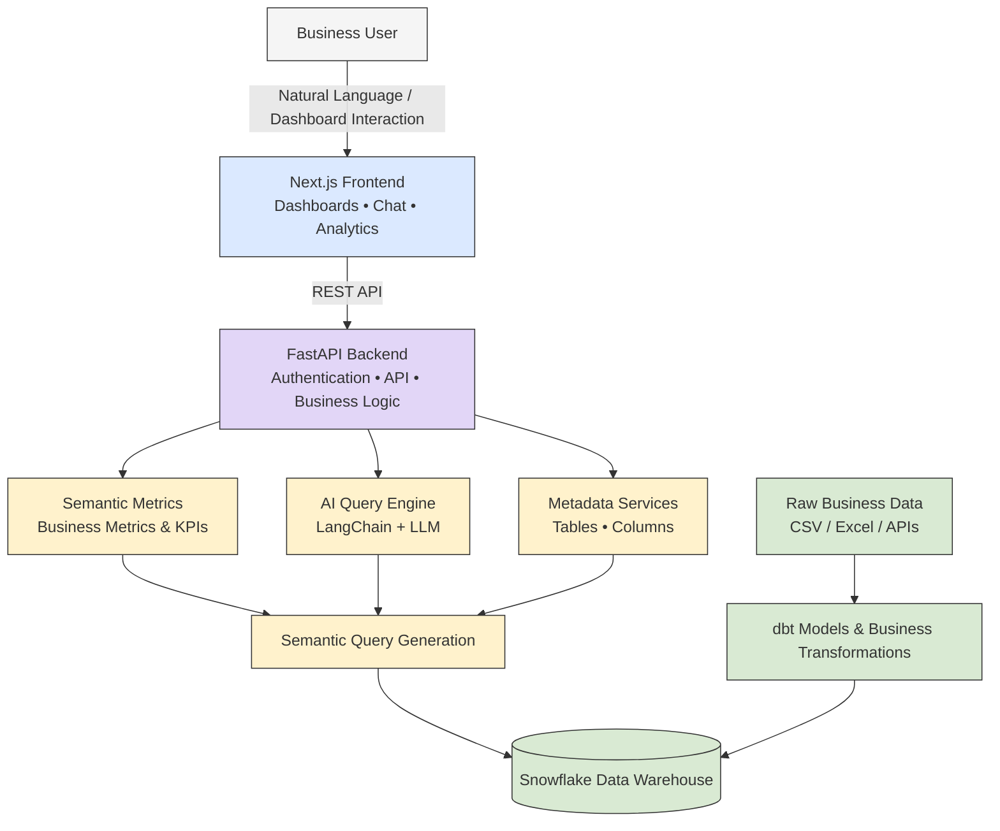

# 🚀 MetricMind

<p align="center">


</p>

<h3 align="center">
Enterprise Semantic Business Intelligence Engine
</h3>

<p align="center">
Transform natural language into governed business insights using a custom semantic layer, Snowflake, FastAPI and modern analytics engineering.
</p>

---

# 📖 Project Overview

MetricMind is an enterprise-grade **Semantic Business Intelligence (BI) Engine** designed to bridge the gap between business users and enterprise data.

Instead of requiring users to write SQL, MetricMind understands natural language business questions, converts them into semantic query plans, generates optimized SQL, executes the queries on Snowflake, and returns structured business insights through REST APIs.

The project follows modern Analytics Engineering practices using **Snowflake**, **FastAPI**, **dbt**, and a custom-built semantic layer, making it scalable, modular, and AI-ready.

MetricMind is being developed as a production-oriented analytics platform capable of supporting:

- Semantic Metrics
- Natural Language Querying
- Intelligent SQL Generation
- Business KPI Analytics
- Enterprise Semantic Layer
- AI-powered Business Intelligence (Upcoming)

---

# ✨ Current Features

## Semantic Intelligence

- ✅ Semantic Metric Detection
- ✅ Natural Language Query Planning
- ✅ Dynamic SQL Generation
- ✅ Enterprise Semantic Layer
- ✅ Snowflake Query Execution

---

## Business Intelligence

- ✅ KPI Queries
- ✅ Business Filter Detection
- ✅ GROUP BY Detection
- ✅ ORDER BY Detection
- ✅ LIMIT Detection
- ✅ Aggregate Filtering (HAVING)

---

## Time Intelligence

- ✅ Year Filters
- ✅ Relative Time Intelligence
- ✅ Date Range Queries
- ✅ Quarter Intelligence
- ✅ Quarter Comparison

---

## Comparison Engine

- ✅ State Comparison
- ✅ Category Comparison
- ✅ Quarter Comparison
- ✅ Multi-dimensional Semantic Queries

---

## Backend APIs

- ✅ FastAPI REST APIs
- ✅ Metadata Discovery APIs
- ✅ Semantic Query APIs
- ✅ Snowflake Integration

---

## 🚧 Upcoming Features

- Conversational BI Assistant
- AI Dashboard Generation
- Visualization Recommendation Engine
- LangChain Integration
- Interactive Analytics Dashboard
- Authentication & User Management
- Query History
- KPI Monitoring
- Report Export (PDF / Excel)

---

# 🏗 Project Architecture


```mermaid
flowchart TD
    A[Business User]
    B[Next.js Frontend<br/>Dashboards • Chat • Analytics]
    C[FastAPI Backend<br/>Authentication • API • Business Logic]
    D[Semantic Metrics<br/>Business Metrics & KPIs]
    E[AI Query Engine<br/>LangChain + LLM]
    F[Metadata Services<br/>Tables • Columns]
    G[Semantic Query Generation]
    H[(Snowflake Data Warehouse)]
    I[dbt Models & Business Transformations]
    J[Raw Business Data<br/>CSV / Excel / APIs]

    A -->|Natural Language / Dashboard Interaction| B
    B -->|REST API| C
    C --> D
    C --> E
    C --> F
    D --> G
    E --> G
    F --> G
    G --> H
    J --> I
    I --> H

    classDef user fill:#f5f5f5,stroke:#333,stroke-width:1px;
    classDef frontend fill:#dbe9ff,stroke:#333,stroke-width:1px;
    classDef backend fill:#e2d6f7,stroke:#333,stroke-width:1px;
    classDef core fill:#fff2cc,stroke:#333,stroke-width:1px;
    classDef data fill:#d9ead3,stroke:#333,stroke-width:1px;

    class A user;
    class B frontend;
    class C backend;
    class D,E,F,G core;
    class H,I,J data;
```

---

# 🛠 Technology Stack

| Layer | Technology |
|--------|------------|
| Programming Language | Python 3.13 |
| Backend Framework | FastAPI |
| Database | Snowflake |
| Data Transformation | dbt |
| Semantic Layer | Custom Python Semantic Layer |
| REST APIs | FastAPI |
| AI Integration | LangChain *(Planned)* |
| Frontend | Next.js *(Planned)* |
| Version Control | Git & GitHub |
| IDE | PyCharm |
| API Testing | Swagger UI / Postman |

---

# 📂 Project Structure

```text
MetricMind/
│
├── backend/
│   ├── app/
│   │   ├── api/                 # REST API endpoints
│   │   ├── semantic/            # Semantic metrics & metadata
│   │   ├── services/            # Query planner & SQL generator
│   │   ├── database/            # Snowflake connection
│   │   └── main.py              # FastAPI entry point
│   │
│   ├── database/
│   │   └── migrations/          # Database migration scripts
│   │
│   └── requirements.txt
│
├── frontend/                    # Next.js Frontend (Upcoming)
├── dashboard/                   # Dashboard (Upcoming)
├── dbt/                         # dbt Models
├── docs/                        # Documentation
├── sql/                         # SQL Scripts
├── images/                      # Project Images
├── tests/                       # Unit Tests
│
├── README.md
└── .gitignore
```

---

# 📡 REST API Endpoints

MetricMind exposes REST APIs for metadata discovery and semantic business queries.

| Method | Endpoint | Description |
|--------|----------|-------------|
| GET | `/` | Welcome endpoint |
| GET | `/health` | Health check |
| GET | `/db-health` | Verify Snowflake connection |
| GET | `/tables` | List available tables |
| GET | `/tables/{table_name}/columns` | Retrieve table schema |
| POST | `/queryplanner` | Generate semantic query plan |
| POST | `/generate-sql` | Generate SQL from semantic query plan |
| POST | `/ask` | Execute natural language query and return results |

---

# 💬 Example Natural Language Queries

MetricMind currently understands a wide variety of business questions.

## 📊 KPI Queries

```text
Total Sales
Total Profit
Total Orders
Total Quantity
Average Discount
```

---

## 🏢 Business Filters

```text
Sales in California
Profit in Texas
Technology Sales
Furniture Profit
Office Supplies Orders
```

---

## 📈 Group By Queries

```text
Sales by City
Profit by Category
Orders by State
Sales by Region
Profit by Segment
```

---

## 🏆 Ranking Queries

```text
Top 10 Cities by Sales
Top 5 Categories by Profit
Highest Profit States
Lowest Sales Regions
Top 20 Cities by Orders
```

---

## 🔍 Aggregate Filtering (HAVING)

```text
Cities with Sales above 500000
Categories with Profit below 10000
States with Orders above 2000
```

---

## 🔄 Business Comparison Queries

```text
Compare California and Texas Sales
Compare Technology and Furniture Profit
Compare Office Supplies and Technology Orders
```

---

## 📅 Time Intelligence

```text
Sales in 2014
Profit after 2013
Sales between 2012 and 2014
Orders this year
Sales last year
Profit previous year
```

---

## 🗓 Quarter Intelligence

```text
Sales in Q1
Profit in Quarter 2
Orders in Q3
Sales in Q2 2014
Profit in Q4 this year
Compare Q1 and Q2 Sales
Compare Q3 and Q4 Profit
```

---

## 🚀 Complex Semantic Queries

```text
Top 10 Cities with Sales between 2012 and 2014

Top 5 Categories with Sales above 500000

Compare Technology and Furniture Profit

Compare Q1 and Q2 Sales in 2014

Sales in California during Q2

Categories with Profit after 2013

Top 10 Cities by Profit in Q3
```

---

# 🧠 Semantic Engine Capabilities

MetricMind converts natural language into optimized SQL using a modular semantic engine.

Current semantic capabilities include:

| Capability | Status |
|------------|:------:|
| Semantic Metric Detection | ✅ |
| Business Filter Detection | ✅ |
| Query Planning | ✅ |
| Dynamic SQL Generation | ✅ |
| Snowflake Execution | ✅ |
| GROUP BY Detection | ✅ |
| ORDER BY Detection | ✅ |
| LIMIT Detection | ✅ |
| Aggregate Filtering (HAVING) | ✅ |
| Business Comparisons | ✅ |
| Relative Time Intelligence | ✅ |
| Date Range Intelligence | ✅ |
| Quarter Intelligence | ✅ |
| Quarter Comparison | ✅ |

---

# ⚙️ Installation

Clone the repository

```bash
git clone https://github.com/<your-username>/MetricMind.git
```

Navigate into the project

```bash
cd MetricMind
```

Create a virtual environment

```bash
python -m venv .venv
```

Activate the environment

Windows

```bash
.venv\Scripts\activate
```

Linux / macOS

```bash
source .venv/bin/activate
```

Install dependencies

```bash
pip install -r backend/requirements.txt
```

---

# ▶️ Running the Project

Start the FastAPI server

```bash
uvicorn app.main:app --reload
```

Open Swagger UI

```text
http://127.0.0.1:8000/docs
```

Open ReDoc

```text
http://127.0.0.1:8000/redoc
```
---

# 📊 Current Project Progress

MetricMind is under active development.

| Module | Status |
|---------|:------:|
| Backend APIs | ✅ Completed (Core) |
| Semantic Query Engine | ✅ Completed |
| Snowflake Integration | ✅ Completed |
| Natural Language Query Planner | ✅ Completed |
| Dynamic SQL Generator | ✅ Completed |
| Frontend Dashboard | 🚧 In Progress |
| AI Copilot (LLM) | 🚧 Planned |

---

# 🚀 Project Status

**Status:** 🟢 Active Development

**Current Version:** v0.9 (Backend)

**Backend Completion:** ~92%

---

# 🎯 Why MetricMind?

MetricMind is designed to simplify business analytics by allowing users to interact with enterprise data using natural language instead of writing SQL.

Current capabilities include:

- Semantic Metric Detection
- Natural Language Query Planning
- Dynamic SQL Generation
- Snowflake Query Execution
- Business Filter Detection
- GROUP BY, ORDER BY & LIMIT Intelligence
- Aggregate Filtering (HAVING)
- Business Comparisons
- Relative Time Intelligence
- Date Range Queries
- Quarter Intelligence
- Quarter Comparison

The long-term vision is to evolve MetricMind into an AI-powered Business Intelligence platform capable of conversational analytics, intelligent dashboard generation, and automated business insights.

---

# 📄 License

This project is licensed under the MIT License.